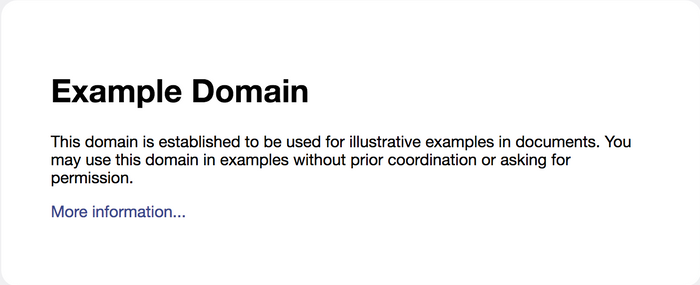

<table align=center>
<tr>
<td>
</td>
<td>

</td>
<td>

</td>
</tr>
</table>
 
<strong>Differencify + Docker</strong>
 
This repository contains the example code for using <a href='https://github.com/NimaSoroush/differencify'>Differencify</a> in Docker

 

## About

Differencify is a library for visual regression testing by comparing your local changes with reference screenshots of your website. It is built on top of chrome headless using [Puppeteer](https://github.com/GoogleChrome/puppeteer)

|Reference|Local changes|
|---------|-------------|
|||

Please read [this article](https://medium.com/@nima.soroush.h/using-differencify-in-docker-and-ci-99e3d1ec057c) for detailed usage of this repository.

## Links
- https://github.com/NimaSoroush/differencify
- https://medium.com/@nima.soroush.h/make-visual-regression-testing-easier-4a3dc7073737
- https://github.com/NimaSoroush/differencify/blob/master/API.md
- https://github.com/GoogleChrome/puppeteer
